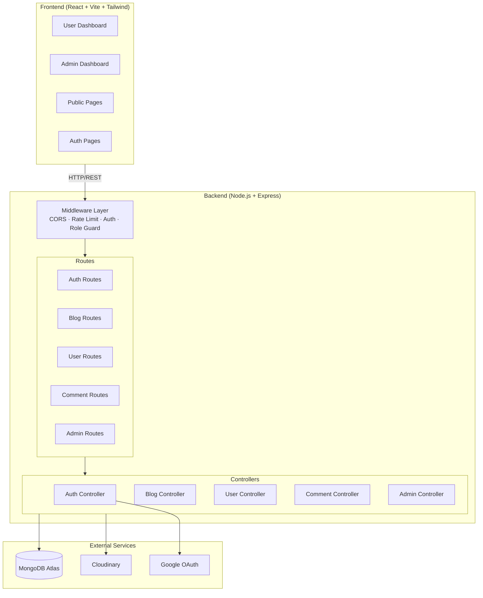
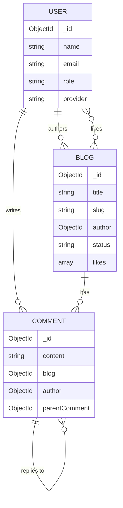
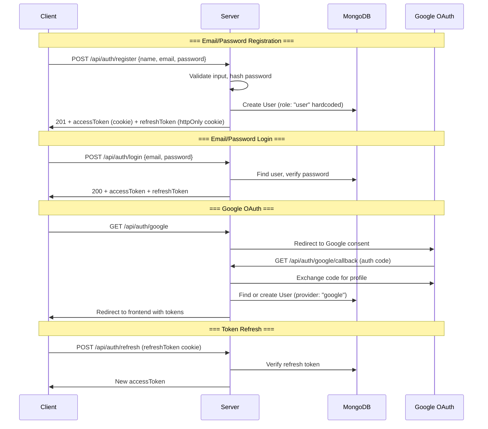

# MERN Blogging Platform — Full Architecture & Implementation Plan

A Medium-style blogging platform with Admin and User dashboards, built with React+Vite, Node+Express, MongoDB, JWT, Google OAuth, Tailwind CSS, and Cloudinary.

---

## 1. System Architecture



### Key Architectural Decisions

| Decision | Choice | Rationale |
|----------|--------|-----------|
| API Style | REST | Simpler for blog CRUD; no complex relational queries |
| Auth | JWT (access + refresh tokens) | Stateless, scalable |
| Image Storage | Cloudinary | CDN-backed, on-the-fly transforms |
| State Mgmt | React Context + React Query | Context for auth, React Query for server state |
| CSS | Tailwind CSS | Rapid UI development, consistent design |

---

## 2. Database Schema Design

### 2.1 User Collection

```js
// models/User.js
const userSchema = new Schema({
  name:          { type: String, required: true, trim: true },
  email:         { type: String, required: true, unique: true, lowercase: true },
  password:      { type: String, select: false },            // null for OAuth users
  avatar:        { type: String, default: "" },              // Cloudinary URL
  bio:           { type: String, maxlength: 300, default: "" },
  role:          { type: String, enum: ["user", "admin"], default: "user" },
  provider:      { type: String, enum: ["local", "google"], default: "local" },
  googleId:      { type: String, sparse: true },
  refreshToken:  { type: String, select: false },
  isVerified:    { type: Boolean, default: false },
  isBanned:      { type: Boolean, default: false },
}, { timestamps: true });
```

### 2.2 Blog Collection

```js
// models/Blog.js
const blogSchema = new Schema({
  title:         { type: String, required: true, trim: true },
  slug:          { type: String, required: true, unique: true },
  content:       { type: String, required: true },           // HTML/Markdown
  excerpt:       { type: String, maxlength: 500 },
  coverImage:    { type: String, default: "" },              // Cloudinary URL
  author:        { type: Schema.Types.ObjectId, ref: "User", required: true },
  category:      { type: String, required: true },
  tags:          [{ type: String, lowercase: true }],
  status:        { type: String, enum: ["draft", "published"], default: "draft" },
  likes:         [{ type: Schema.Types.ObjectId, ref: "User" }],
  likesCount:    { type: Number, default: 0 },
  commentsCount: { type: Number, default: 0 },
  readTime:      { type: Number },                           // minutes
  views:         { type: Number, default: 0 },
}, { timestamps: true });
```

### 2.3 Comment Collection

```js
// models/Comment.js
const commentSchema = new Schema({
  content:    { type: String, required: true, maxlength: 1000 },
  blog:       { type: Schema.Types.ObjectId, ref: "Blog", required: true },
  author:     { type: Schema.Types.ObjectId, ref: "User", required: true },
  parentComment: { type: Schema.Types.ObjectId, ref: "Comment", default: null }, // for replies
  isDeleted:  { type: Boolean, default: false },              // soft delete for moderation
}, { timestamps: true });
```

### 2.4 Bookmark Collection

```js
// models/Bookmark.js
const bookmarkSchema = new Schema({
  user:  { type: Schema.Types.ObjectId, ref: "User", required: true },
  blog:  { type: Schema.Types.ObjectId, ref: "Blog", required: true },
}, { timestamps: true });

// Compound unique index — one bookmark per user per blog
bookmarkSchema.index({ user: 1, blog: 1 }, { unique: true });
```

### 2.5 Collection Relationships



---

## 3. Folder Structure

```
Blog based project/
├── backend/
│   ├── config/
│   │   ├── db.js                 # MongoDB connection
│   │   ├── cloudinary.js         # Cloudinary config
│   │   └── passport.js           # Google OAuth strategy
│   ├── controllers/
│   │   ├── authController.js     # Register, Login, OAuth, Refresh
│   │   ├── blogController.js     # CRUD blogs
│   │   ├── commentController.js  # CRUD comments
│   │   ├── userController.js     # Profile, user management
│   │   └── adminController.js    # Admin analytics, moderation
│   ├── middleware/
│   │   ├── auth.js               # JWT verification
│   │   ├── roleGuard.js          # Role-based access (admin/user)
│   │   ├── ownership.js          # Verify resource ownership
│   │   ├── upload.js             # Multer + Cloudinary upload
│   │   ├── rateLimiter.js        # Rate limiting
│   │   └── errorHandler.js       # Global error handler
│   ├── models/
│   │   ├── User.js
│   │   ├── Blog.js
│   │   └── Comment.js
│   ├── routes/
│   │   ├── authRoutes.js
│   │   ├── blogRoutes.js
│   │   ├── commentRoutes.js
│   │   ├── userRoutes.js
│   │   └── adminRoutes.js
│   ├── utils/
│   │   ├── generateToken.js      # JWT sign helper
│   │   ├── slugify.js            # Slug generation
│   │   ├── calcReadTime.js       # Read time calculator
│   │   └── ApiError.js           # Custom error class
│   ├── validators/
│   │   ├── authValidator.js      # Input validation schemas
│   │   ├── blogValidator.js
│   │   └── commentValidator.js
│   ├── seeds/
│   │   └── adminSeed.js          # Create initial admin user
│   ├── .env
│   ├── .env.example
│   ├── server.js
│   └── package.json
│
├── frontend/
│   ├── public/
│   ├── src/
│   │   ├── api/
│   │   │   └── axios.js          # Axios instance with interceptors
│   │   ├── assets/
│   │   ├── components/
│   │   │   ├── common/           # Navbar, Footer, Button, Modal, Loader
│   │   │   ├── blog/             # BlogCard, BlogList, BlogEditor, LikeBtn
│   │   │   ├── comment/          # CommentForm, CommentList, CommentItem
│   │   │   └── admin/            # UserTable, BlogTable, StatsCard, Charts
│   │   ├── context/
│   │   │   └── AuthContext.jsx   # Auth state + provider
│   │   ├── hooks/
│   │   │   ├── useAuth.js
│   │   │   ├── useBlogs.js
│   │   │   └── useComments.js
│   │   ├── layouts/
│   │   │   ├── MainLayout.jsx    # Public layout
│   │   │   ├── DashboardLayout.jsx # User dashboard layout
│   │   │   └── AdminLayout.jsx   # Admin layout + sidebar
│   │   ├── pages/
│   │   │   ├── public/           # Home, BlogDetail, Login, Register
│   │   │   ├── dashboard/        # UserDashboard, MyBlogs, CreateBlog, EditBlog, Profile
│   │   │   └── admin/            # AdminDashboard, ManageUsers, ManageBlogs, ManageComments
│   │   ├── routes/
│   │   │   ├── AppRoutes.jsx
│   │   │   ├── ProtectedRoute.jsx
│   │   │   └── AdminRoute.jsx
│   │   ├── utils/
│   │   │   ├── formatDate.js
│   │   │   └── constants.js
│   │   ├── App.jsx
│   │   ├── main.jsx
│   │   └── index.css             # Tailwind directives
│   ├── tailwind.config.js
│   ├── vite.config.js
│   └── package.json
│
├── .gitignore
└── README.md
```

---

## 4. API Architecture

### 4.1 Auth Routes — `/api/auth`

| Method | Endpoint | Access | Description |
|--------|----------|--------|-------------|
| POST | `/register` | Public | Register new user (always `role: "user"`) |
| POST | `/login` | Public | Login with email/password |
| GET | `/google` | Public | Initiate Google OAuth |
| GET | `/google/callback` | Public | Google OAuth callback |
| POST | `/refresh` | Public | Refresh access token |
| POST | `/logout` | Auth | Clear refresh token |
| GET | `/me` | Auth | Get current user |

### 4.2 Blog Routes — `/api/blogs`

| Method | Endpoint | Access | Description |
|--------|----------|--------|-------------|
| GET | `/` | Public | List published blogs (paginated, filter, search) |
| GET | `/:slug` | Public | Get single blog by slug |
| POST | `/` | Auth | Create blog |
| PUT | `/:id` | Auth + Owner | Update blog |
| DELETE | `/:id` | Auth + Owner/Admin | Delete blog |
| PUT | `/:id/like` | Auth | Toggle like |
| GET | `/my-blogs` | Auth | Get current user's blogs |

### 4.3 Comment Routes — `/api/blogs/:blogId/comments`

| Method | Endpoint | Access | Description |
|--------|----------|--------|-------------|
| GET | `/` | Public | List comments for a blog |
| POST | `/` | Auth | Add comment |
| PUT | `/:commentId` | Auth + Owner | Edit comment |
| DELETE | `/:commentId` | Auth + Owner/Admin | Delete comment |

### 4.4 User Routes — `/api/users`

| Method | Endpoint | Access | Description |
|--------|----------|--------|-------------|
| GET | `/:id` | Public | Get user profile |
| PUT | `/profile` | Auth | Update own profile |
| PUT | `/avatar` | Auth | Upload avatar |
| PUT | `/change-password` | Auth | Change password |

### 4.5 Admin Routes — `/api/admin`

| Method | Endpoint | Access | Description |
|--------|----------|--------|-------------|
| GET | `/dashboard` | Admin | Analytics (user count, blog count, etc.) |
| GET | `/users` | Admin | List all users |
| PUT | `/users/:id/ban` | Admin | Ban/unban user |
| DELETE | `/users/:id` | Admin | Delete user |
| GET | `/blogs` | Admin | List all blogs (inc. drafts) |
| DELETE | `/blogs/:id` | Admin | Delete any blog |
| GET | `/comments` | Admin | List reported/all comments |
| DELETE | `/comments/:id` | Admin | Delete any comment |

---

## 5. Authentication Flow



### Token Strategy

| Token | Storage | Lifetime | Purpose |
|-------|---------|----------|---------|
| Access Token | httpOnly cookie | 15 min | API authentication |
| Refresh Token | httpOnly cookie + DB | 7 days | Generate new access tokens |

> [!IMPORTANT]
> The `role` field is **hardcoded to `"user"`** on registration. The only way to create an admin is via the `seeds/adminSeed.js` script run manually on the server. There is no API endpoint to set role to admin.

---

## 6. Authorization Flow

```mermaid
flowchart TD
    REQ["Incoming Request"] --> AUTH{"auth middleware<br/>Valid JWT?"}
    AUTH -->|No| R401["401 Unauthorized"]
    AUTH -->|Yes| BANNED{"User banned?"}
    BANNED -->|Yes| R403B["403 Banned"]
    BANNED -->|No| ROUTE{"Route type?"}

    ROUTE -->|Admin Route| ROLE{"roleGuard('admin')<br/>user.role === 'admin'?"}
    ROLE -->|No| R403["403 Forbidden"]
    ROLE -->|Yes| ADMIN_CTRL["Admin Controller"]

    ROUTE -->|User Route<br/>(own resource)| OWN{"ownership middleware<br/>resource.author === user._id?"}
    OWN -->|No| R403_2["403 Forbidden"]
    OWN -->|Yes| USER_CTRL["User Controller"]

    ROUTE -->|Public Auth Route| USER_CTRL2["Controller"]
```

### Middleware Chain Examples

```
Admin delete any blog:   auth → roleGuard("admin") → adminController.deleteBlog
User edit own blog:      auth → ownership("Blog") → blogController.updateBlog
User delete own blog:    auth → ownership("Blog") → blogController.deleteBlog
Admin delete any blog:   auth → roleGuard("admin") → adminController.deleteBlog
Public read blog:        (no auth) → blogController.getBlog
```

---

## 7. Recommended Development Order

### Phase 1 — Foundation (Days 1–2)
- [x] Initialize backend project (already done)
- [x] Set up MongoDB connection (`config/db.js`)
- [x] Create `.env.example` with all environment variables
- [x] Set up global error handler middleware (`middleware/errorHandler.js`)
- [x] Create all 4 Mongoose models (User, Blog, Comment, Bookmark)
- [x] Set up basic Express middleware (cors, cookie-parser, json)
- [x] Create `utils/ApiError.js` custom error class
- [x] Update `server.js` with full Express setup + health check endpoint
- [ ] **YOU DO THIS:** Copy `.env.example` → `.env` and fill in your real `MONGO_URI`

### Phase 2 — Authentication (Days 3–4)
- [ ] Implement register/login controllers
- [ ] Implement JWT token generation (access + refresh)
- [ ] Create `auth` middleware for protecting routes
- [ ] Create `roleGuard` middleware
- [ ] Implement Google OAuth with Passport.js
- [ ] Implement token refresh & logout
- [ ] Create admin seed script
- [ ] Test all auth endpoints with Postman/Thunder Client

### Phase 3 — Blog CRUD (Days 5–6)
- [ ] Implement blog CRUD controllers
- [ ] Add slug generation with `slugify`
- [ ] Set up Cloudinary for image uploads
- [ ] Create `ownership` middleware
- [ ] Add like/unlike functionality
- [ ] Add pagination, filtering, search
- [ ] Test all blog endpoints

### Phase 4 — Comments (Day 7)
- [ ] Implement comment CRUD controllers
- [ ] Add nested replies support
- [ ] Test comment endpoints

### Phase 5 — Admin Backend (Day 8)
- [ ] Implement admin dashboard analytics
- [ ] Implement user management (list, ban, delete)
- [ ] Implement blog/comment moderation
- [ ] Test admin endpoints

### Phase 6 — Frontend Setup (Days 9–10)
- [ ] Initialize React + Vite project
- [ ] Set up Tailwind CSS
- [ ] Set up React Router with route guards
- [ ] Create layouts (Main, Dashboard, Admin)
- [ ] Set up Axios instance with interceptors
- [ ] Create AuthContext

### Phase 7 — Frontend Auth Pages (Days 11–12)
- [ ] Build Login, Register pages
- [ ] Integrate Google OAuth button
- [ ] Implement protected/admin routes
- [ ] Build Navbar with auth state

### Phase 8 — Frontend Blog Pages (Days 13–15)
- [ ] Build Home page (blog listing)
- [ ] Build Blog detail page
- [ ] Build Blog editor (create/edit) with rich text
- [ ] Build "My Blogs" page
- [ ] Implement like/comment UI

### Phase 9 — Frontend Dashboards (Days 16–18)
- [ ] Build User Dashboard
- [ ] Build Admin Dashboard with charts
- [ ] Build admin management pages (users, blogs, comments)

### Phase 10 — Polish & Deploy (Days 19–20)
- [ ] Add loading states, error boundaries
- [ ] Responsive design pass
- [ ] Performance optimization
- [ ] Deploy backend to Render/Railway
- [ ] Deploy frontend to Vercel
- [ ] Configure production environment variables

---

## 8. Security Considerations

> [!CAUTION]
> These are critical security measures that must not be skipped.

### Authentication & Authorization
| Measure | Implementation |
|---------|---------------|
| Password hashing | `bcryptjs` with salt rounds ≥ 10 |
| JWT storage | httpOnly, Secure, SameSite cookies — **never localStorage** |
| Role enforcement | `role: "user"` is hardcoded on registration; no API to change roles |
| Admin creation | CLI seed script only; no public registration path |
| Refresh token rotation | Invalidate old refresh token when issuing new one |
| Ban check | Verify `isBanned` on every authenticated request |

### Input Validation & Sanitization
| Measure | Implementation |
|---------|---------------|
| Input validation | `express-validator` or `joi` on all endpoints |
| XSS prevention | Sanitize HTML content in blog posts (e.g., `sanitize-html`) |
| NoSQL injection | Mongoose handles parameterization; avoid `$where` |
| File upload | Restrict file types (images only), max size 5MB |

### Rate Limiting & Protection
| Measure | Implementation |
|---------|---------------|
| Rate limiting | `express-rate-limit` — 100 req/15min general, 5 req/15min for login |
| CORS | Whitelist only the frontend origin |
| Helmet | Set security headers with `helmet` |
| MongoDB injection | Never pass raw `req.body` to queries |

### Additional Packages to Install

```bash
# Backend - add these to existing deps
npm install helmet express-rate-limit express-validator sanitize-html multer multer-storage-cloudinary passport passport-google-oauth20
```

---

## 9. Environment Variables

```env
# .env.example
PORT=5000
NODE_ENV=development

# MongoDB
MONGO_URI=mongodb+srv://<user>:<pass>@cluster.mongodb.net/blogplatform

# JWT
JWT_ACCESS_SECRET=your-access-secret-here
JWT_REFRESH_SECRET=your-refresh-secret-here
JWT_ACCESS_EXPIRE=15m
JWT_REFRESH_EXPIRE=7d

# Google OAuth
GOOGLE_CLIENT_ID=your-google-client-id
GOOGLE_CLIENT_SECRET=your-google-client-secret
GOOGLE_CALLBACK_URL=http://localhost:5000/api/auth/google/callback

# Cloudinary
CLOUDINARY_CLOUD_NAME=your-cloud-name
CLOUDINARY_API_KEY=your-api-key
CLOUDINARY_API_SECRET=your-api-secret

# Frontend
CLIENT_URL=http://localhost:5173

# Admin Seed
ADMIN_EMAIL=admin@yourdomain.com
ADMIN_PASSWORD=securepassword
```

---

## 10. Scalable Architecture for Future Improvements

| Feature | Description |
|---------|-------------|
| **Email notifications** | Notify users on new comments, likes (use Nodemailer + queue) |
| **Bookmarks/Reading Lists** | New `Bookmark` collection linking users to blogs |
| **Follow system** | Users follow other users; personalized feed |
| **Rich text editor** | Integrate Tiptap or EditorJS for Medium-like editing |
| **Full-text search** | MongoDB Atlas Search or Elasticsearch for blog search |
| **Image optimization** | Cloudinary auto-format/resize transformations |
| **Caching** | Redis for frequently accessed blog lists and user sessions |
| **WebSockets** | Real-time notifications with Socket.io |
| **CI/CD** | GitHub Actions for automated testing and deployment |
| **API versioning** | Prefix routes with `/api/v1/` from the start |
| **Microservices** | Extract auth, blog, notification into separate services if traffic grows |
| **CDN** | Serve frontend from Cloudflare/Vercel Edge for global performance |

---

## User Review Required

> [!IMPORTANT]
> **MongoDB Atlas vs Local MongoDB**: Do you have a MongoDB Atlas connection string ready, or should I set up for local MongoDB?

> [!IMPORTANT]
> **Google OAuth**: Do you have Google Cloud Console credentials (Client ID / Secret) ready? We'll need these before implementing OAuth.

> [!IMPORTANT]
> **Cloudinary**: Do you have a Cloudinary account with API keys? Needed for image upload functionality.

> [!IMPORTANT]
> **Rich Text Editor**: For the blog editor, do you have a preference? Options: **TipTap** (modern, extensible), **React Quill** (simple), or **EditorJS** (block-based like Medium).

## Open Questions

1. **Categories** — Do you want predefined categories (e.g., Tech, Lifestyle, Travel) or free-form user-entered categories?
2. **Email verification** — Should users verify their email before being able to post blogs?
3. **Admin count** — Will there always be just one admin (you), or could there be multiple admins in the future?
4. **Blog content format** — Markdown or rich HTML? This affects the editor and storage strategy.

---

## Verification Plan

### Automated Tests
- Test each API endpoint with Postman/Thunder Client during development
- Verify auth flow: register → login → access protected route → refresh → logout
- Verify authorization: user cannot access `/api/admin/*`, user cannot edit another user's blog
- Verify role hardcoding: registration always creates `role: "user"`

### Manual Verification
- End-to-end flow: register → create blog → view blog → comment → like
- Admin flow: login as admin → view dashboard → ban user → delete blog
- Google OAuth flow: login with Google → profile created → can create blogs
- Security: try to access admin routes with user token → expect 403
